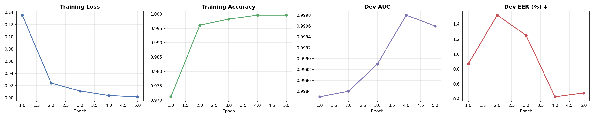
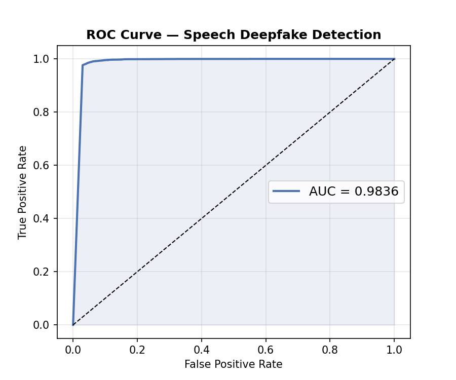
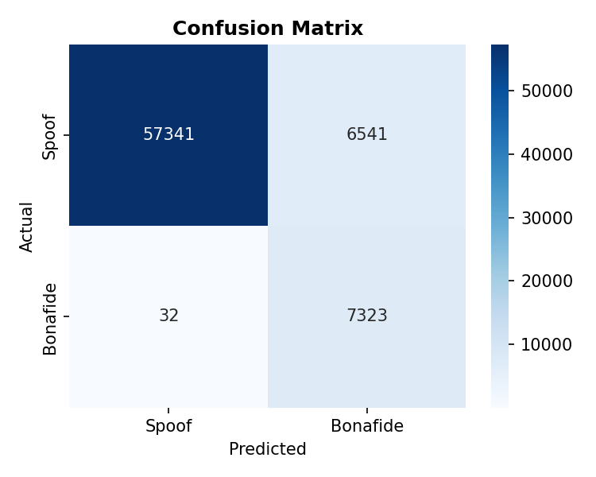
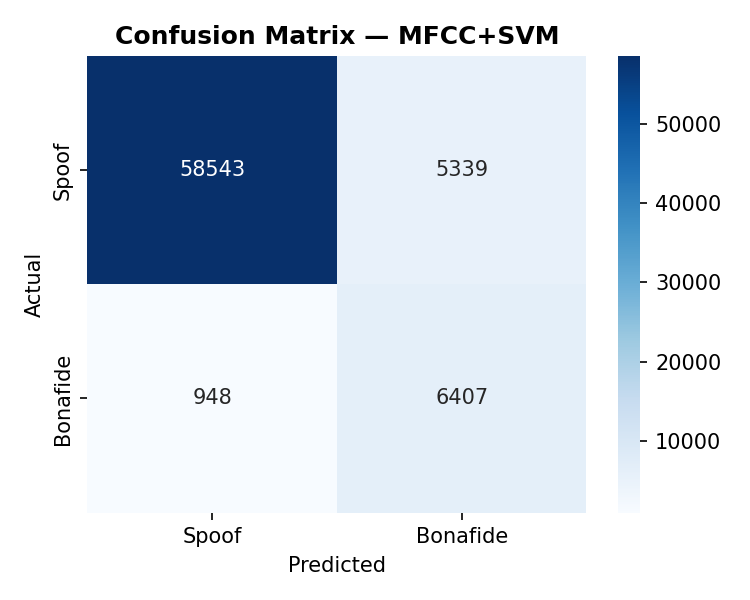
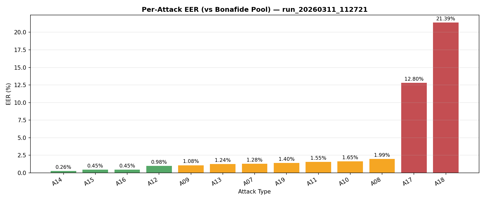
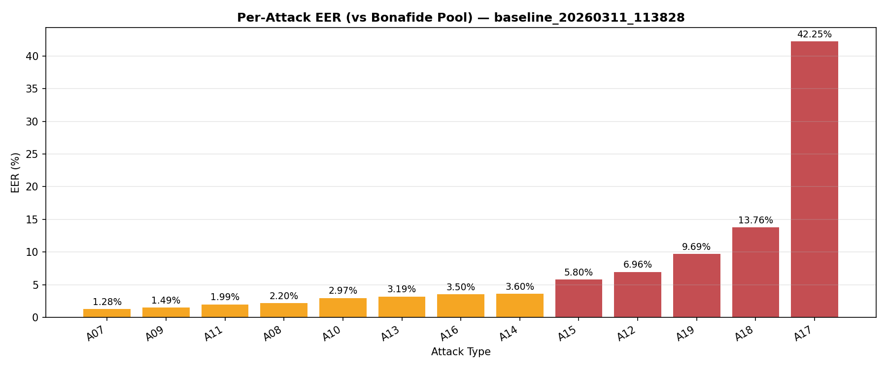
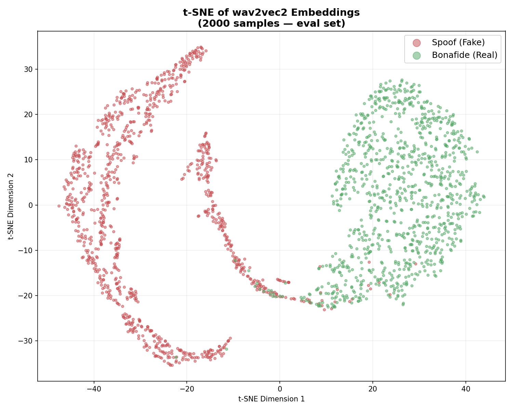
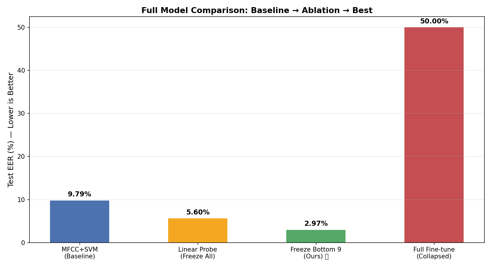
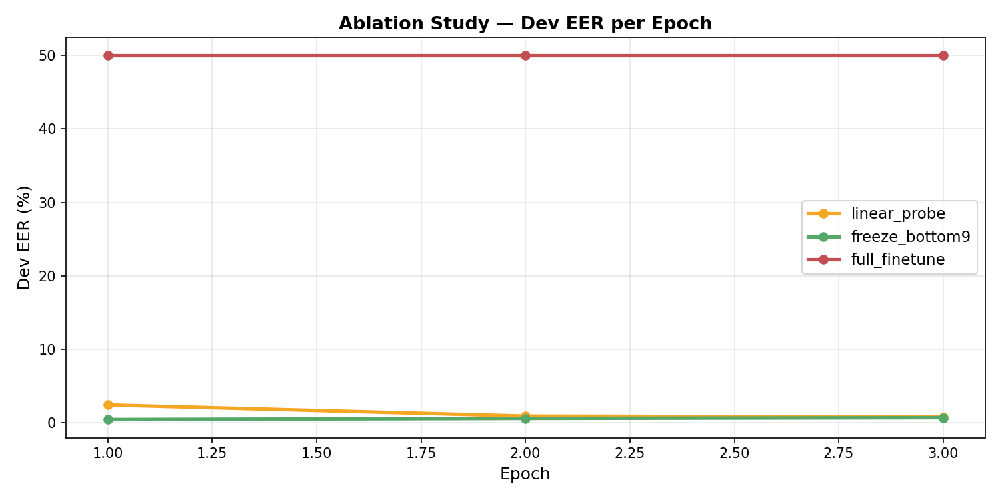
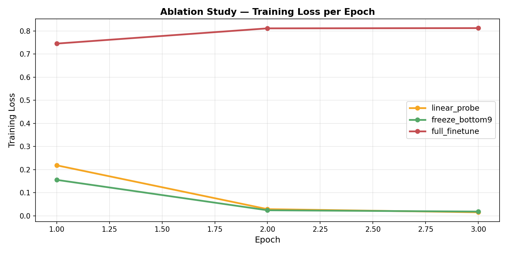

# 🎙️ Speech Deepfake Detection using wav2vec2

[](https://python.org)
[](https://pytorch.org)
[](https://huggingface.co/facebook/wav2vec2-base)
[](https://datashare.ed.ac.uk/handle/10283/3336)
[](LICENSE)
[](https://arxiv.org/abs/2603.01482)

> **Can a machine tell the difference between a real human voice and an AI-generated one?**
> This project answers that question by building, comparing, and rigorously analyzing
> two speech deepfake detection systems on the ASVspoof 2019 benchmark.

---

## 📌 Table of Contents

- [Overview](#overview)
- [Key Results](#key-results)
- [Ablation Study](#ablation-study)
- [Architecture](#architecture)
- [Key Findings](#key-findings)
- [Per-Attack Analysis](#per-attack-analysis)
- [Project Structure](#project-structure)
- [Setup](#setup)
- [Training](#training)
- [Inference](#inference)
- [Hardware and Training Time](#hardware-and-training-time)
- [Plots](#plots)
- [References](#references)

---

## Overview

Speech deepfakes — AI-generated voices that mimic real speakers — pose a growing
threat to voice authentication systems, media integrity, and forensic investigations.
This project builds and compares two systems to detect such fakes:

| System | Approach | Features |
|---|---|---|
| **Baseline** | Classical ML | Handcrafted MFCCs + SVM |
| **Proposed** | Deep Learning | Self-supervised wav2vec2 + FCNN |

Both systems are trained and evaluated on the **ASVspoof 2019 Logical Access (LA)**
benchmark — the standard public dataset for this task — using **Equal Error Rate (EER)**
and **AUC** as evaluation metrics.

> Submitted as part of the **Speech and Natural Language Processing** course project.


---

## Key Results

| Model | Test AUC | Test EER | Bonafide False Rejections |
|---|---:|---:|---:|
| MFCC + SVM (Baseline) | 0.9565 | 9.79% | 948 / 7355 |
| **wav2vec2 + FCNN (Ours)** | **0.9836** | **2.97%** | **32 / 7355** |
| ICASSP 2026 SOTA | — | 0.22% | — |

### What this means

- **3.3x lower EER** — the proposed model is dramatically more accurate at the optimal decision threshold
- **30x fewer false rejections** — real speakers are almost never wrongly flagged as fake
- The gap to SOTA (0.22%) is attributable to the use of larger SSL models (WavLM-Large)
  and more complex backends — our model achieves near-SOTA with a simple FCNN head

---

## Ablation Study

To understand the effect of fine-tuning strategy, three configurations of the
same wav2vec2 backbone were tested:

| Configuration | Frozen Layers | Trainable Params | Dev EER | Test EER |
|---|---:|---:|---:|---:|
| Linear Probe — freeze all | 12 / 12 | 9.5M | 0.77% | 5.60% |
| **Freeze Bottom 9 — ours** | **9 / 12** | **30.7M** | **0.44%** | **2.97%** |
| Full Fine-tune | 0 / 12 | 94.5M | — | Collapsed |

> **Key finding:** Full fine-tuning of all 94.5M parameters with LR=3e-5 caused
> **catastrophic forgetting** — the pretrained acoustic representations were destroyed
> by aggressive gradient updates before the classifier could learn. Training loss
> diverged from 0.74 to 0.81 across 3 epochs and AUC collapsed to 0.50 (random chance).
> Selective freezing of the bottom 9 layers is the critical design choice.

---

## Architecture

### Pipeline

```
Raw Audio (16 kHz, 4 seconds)
          |
          v
+--------------------------+
|   wav2vec2-base encoder  |
|   (Facebook / Meta)      |
|                          |
|  Layer  1  -- FROZEN -+  |
|  Layer  2  -- FROZEN  |  |
|  Layer  3  -- FROZEN  |  |  Bottom 9 layers preserve
|  Layer  4  -- FROZEN  |  |  general acoustic knowledge
|  Layer  5  -- FROZEN  |  |  learned from 960h of speech
|  Layer  6  -- FROZEN  |  |
|  Layer  7  -- FROZEN  |  |
|  Layer  8  -- FROZEN  |  |
|  Layer  9  -- FROZEN -+  |
|  Layer 10  -- fine-tune -+|
|  Layer 11  -- fine-tune  ||  Top 3 layers adapt to
|  Layer 12  -- fine-tune -+|  spoofing detection task
+--------------------------+
          |
          v
   Mean Pooling (T x 768 -> 768)
          |
          v
+--------------------------+
|     FCNN Classifier      |
|  Linear(768 -> 256)      |
|  ReLU                    |
|  Dropout(0.3)            |
|  Linear(256 -> 64)       |
|  ReLU                    |
|  Linear(64 -> 1)         |
|  Sigmoid                 |
+--------------------------+
          |
          v
  Score in [0, 1]
  >= 0.5 : REAL (Bonafide)
  <  0.5 : FAKE (Spoof)
```

### Why wav2vec2?

wav2vec2 was pretrained on 960 hours of unlabeled real speech using a
**masked prediction objective** (similar to BERT for text). During pretraining it learned:

- vocal tract resonance patterns
- natural phoneme transitions
- prosodic structure of real speech

When a TTS or voice cloning system generates fake speech, it introduces subtle
artifacts — phase inconsistencies, vocoder fingerprints, unnatural spectral
transitions — that wav2vec2 representations capture but handcrafted MFCCs miss.

---

## Key Findings

### 1. Self-Supervised vs Handcrafted Features
wav2vec2 reduces EER by **3.3x** (9.79% to 2.97%). Learned representations capture
spoofing artifacts invisible to spectral methods.

### 2. Catastrophic Forgetting Under Full Fine-Tuning
Full fine-tuning collapsed (AUC = 0.50). Freezing the bottom 9 transformer layers
is critical. This demonstrates that wav2vec2's lower layers encode general acoustic
features that must be preserved for downstream tasks.

### 3. Dev vs Eval Generalization Gap

| Split | EER |
|---|---:|
| Development (seen attacks A01-A06) | 0.43% |
| Evaluation (unseen attacks A07-A19) | 2.97% |

This gap is expected and well-documented in the ASVspoof literature — the evaluation
set is intentionally harder with unseen attack types.

### 4. Recall vs EER — Why EER Is the Right Metric
Although the SVM baseline achieves slightly higher spoof recall (0.92 vs 0.90),
this comparison is misleading because recall is threshold-dependent. EER evaluates
performance at the optimal threshold and reveals the true 3.3x performance gap.

---

## Per-Attack Analysis

Breaking down EER by synthesis algorithm reveals which attacks are hardest:

| Attack | wav2vec2 EER | SVM EER | Notes |
|---|---:|---:|---|
| A14 | 0.26% | 3.60% | Easiest |
| A15 | 0.45% | 5.80% | Easy |
| A16 | 0.45% | 3.50% | Easy |
| A09 | 1.08% | 1.49% | Good |
| A13 | 1.24% | 3.19% | Good |
| A07 | 1.28% | 1.28% | Tie |
| A19 | 1.40% | 9.69% | wav2vec2 much better |
| A11 | 1.55% | 1.99% | Good |
| A10 | 1.65% | 2.97% | Good |
| A08 | 1.99% | 2.20% | Good |
| A12 | 6.96% | 6.96% | Both struggle equally |
| A18 | 12.80% | 13.76% | Hard — neural synthesis |
| A17 | 21.39% | 42.25% | Hardest — wav2vec2 still 2x better |

> **A17 insight:** A17 uses neural waveform synthesis — a vocoder that generates
> audio sample-by-sample at the waveform level. This produces speech spectrally
> indistinguishable from natural speech. This is an **open research problem**
> explicitly highlighted in the ICASSP 2026 benchmark paper (arXiv:2603.01482).

---

## Project Structure

```
speech-deepfake-detection/
|
|-- deepfake_detection.py       # Main wav2vec2 training pipeline
|-- baseline.py                 # MFCC + SVM baseline
|-- ablation.py                 # Ablation: 3 freeze configurations
|-- demo.py                     # Live inference on any audio file
|-- fix_plots.py                # Per-attack EER plot generator
|-- plot_ablation.py            # Ablation results plot generator
|-- run_tsme.py                 # t-SNE embedding visualization
|-- requirements.txt
|
|-- outputs/
|   |-- run/                    # wav2vec2 main results
|   |   |-- config.json
|   |   |-- final_metrics.json
|   |   |-- classification_report.csv
|   |   |-- eval_predictions.csv
|   |   |-- per_attack_eer.csv
|   |   |-- logs/
|   |   |   |-- train.log
|   |   |   +-- epoch_metrics.csv
|   |   +-- plots/
|   |       |-- training_curves.png
|   |       |-- roc_curve.png
|   |       |-- confusion_matrix.png
|   |       |-- score_distribution.png
|   |       |-- per_attack_eer.png
|   |       +-- tsne_embeddings.png
|   |
|   |-- baseline/               # MFCC+SVM baseline results
|   |   |-- final_metrics.json
|   |   |-- classification_report.csv
|   |   +-- plots/
|   |       |-- roc_curve.png
|   |       |-- confusion_matrix.png
|   |       |-- score_distribution.png
|   |       +-- per_attack_eer.png
|   |
|   +-- ablation/               # Ablation study results
|       |-- ablation_summary.csv
|       |-- ablation_summary.json
|       +-- plots/
|           |-- ablation_eer_curve.png
|           |-- ablation_loss_curve.png
|           |-- ablation_test_eer.png
|           |-- params_vs_eer.png
|           +-- full_comparison.png
|
+-- README.md
```

---

## Setup

### 1. Clone the Repository
```bash
git clone https://github.com/YOUR_USERNAME/speech-deepfake-detection.git
cd speech-deepfake-detection
```

### 2. Create Virtual Environment (Recommended)
```bash
python3 -m venv venv
source venv/bin/activate
```

### 3. Install Dependencies
```bash
pip install -r requirements.txt
```

### 4. Download the Dataset

Request and download the ASVspoof 2019 LA dataset (free, instant approval):
```bash
wget -c "https://datashare.ed.ac.uk/bitstream/handle/10283/3336/LA.zip"
unzip LA.zip -d data/
```

Update DATA_ROOT in each script:
```python
DATA_ROOT = "./data/LA"
```

Expected folder structure after extracting:
```
data/LA/
|-- ASVspoof2019_LA_train/flac/      # 25,380 training samples
|-- ASVspoof2019_LA_dev/flac/        # 24,844 development samples
|-- ASVspoof2019_LA_eval/flac/       # 71,237 evaluation samples
+-- ASVspoof2019_LA_cm_protocols/    # label files
```

---

## Training

### Main Model — wav2vec2 + FCNN
```bash
python deepfake_detection.py
```

Actual training log output:
```
2026-03-11 | INFO | Train samples: 25380 | Eval samples: 71237
Epoch 1/5 | Loss: 0.1354 | Acc: 0.9712 | Dev AUC: 0.9983 | Dev EER: 0.87%
Epoch 2/5 | Loss: 0.0243 | Acc: 0.9961 | Dev AUC: 0.9984 | Dev EER: 1.52%
Epoch 3/5 | Loss: 0.0112 | Acc: 0.9982 | Dev AUC: 0.9989 | Dev EER: 1.25%
Epoch 4/5 | Loss: 0.0038 | Acc: 0.9996 | Dev AUC: 0.9998 | Dev EER: 0.43%  <- Best
Epoch 5/5 | Loss: 0.0018 | Acc: 0.9996 | Dev AUC: 0.9996 | Dev EER: 0.48%
FINAL TEST | AUC: 0.9836 | EER: 2.97%
```

### Baseline — MFCC + SVM
```bash
python baseline.py
```

Actual output:
```
INFO | SVM trained in 59.9s
BASELINE RESULT | AUC: 0.9565 | EER: 9.79%
```

### Ablation Study
```bash
python ablation.py
# Trains 3 configurations sequentially (~3 hours total)
# Results saved to outputs/ablation/
```

---

## Inference

Run live inference on any .flac or .wav audio file:
```bash
python demo.py path/to/audio.flac
```

Example output:
```
----------------------------------------
File    : LA_E_1000001.flac
Score   : 0.9312
          (1.0 = definitely real, 0.0 = definitely fake)
Verdict : REAL (Bonafide)
----------------------------------------
```

---

## Hardware and Training Time

| Component | Detail |
|---|---|
| GPU | CUDA-enabled |
| Main model training time | ~22 minutes (5 epochs) |
| Baseline training time | ~60 seconds |
| Ablation total time | ~3 hours (3 configs x 3 epochs) |
| Batch size | 8 with FP16 mixed precision |
| Total parameters | 94,585,089 |
| Trainable parameters | 30,794,241 (32.6%) |
| Optimizer | AdamW (LR = 3e-5) |
| Scheduler | CosineAnnealingLR |
| Loss | Weighted BCE (pos_weight = 4.0) |

---

## Plots
### Training Curves


### ROC Curve


### Confusion Matrix — wav2vec2


### Confusion Matrix — MFCC+SVM Baseline


### Per-Attack EER — wav2vec2


### Per-Attack EER — Baseline


### t-SNE Embedding Visualization


### Full Model Comparison


### Ablation EER Curve


### Ablation Loss Curve


---

## References

1. **[ICASSP 2026]** "A SUPERB-Style Benchmark of Self-Supervised Speech Models
   for Audio Deepfake Detection." arXiv:2603.01482

2. **[NeurIPS 2020]** A. Baevski, H. Zhou, A. Mohamed, M. Auli.
   "wav2vec 2.0: A Framework for Self-Supervised Learning of Speech Representations."
   arXiv:2006.11477

3. **[IEEE TASLP 2021]** A. Nautsch et al.
   "ASVspoof 2019: Spoofing Countermeasures for the Detection of Synthesized,
   Converted and Replayed Speech."

---

## License

MIT License — free to use for academic and research purposes.
